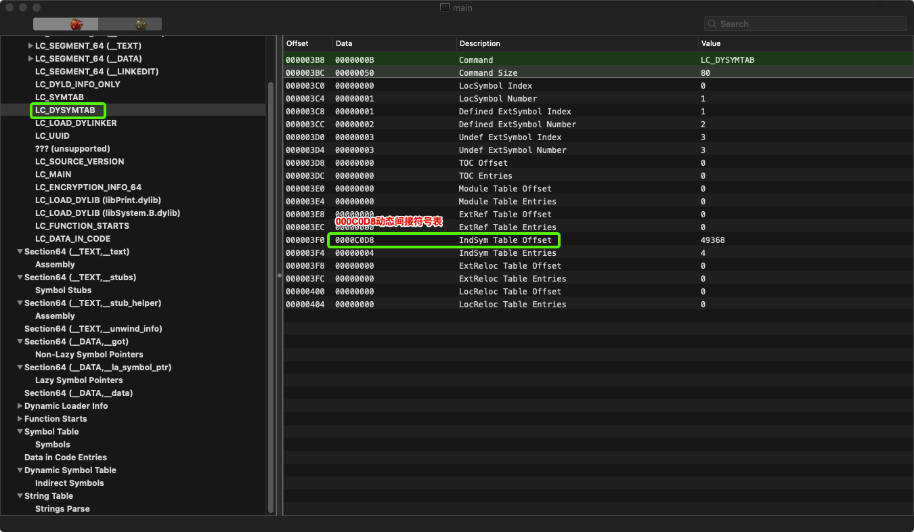
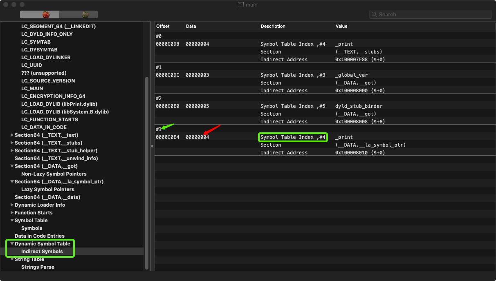
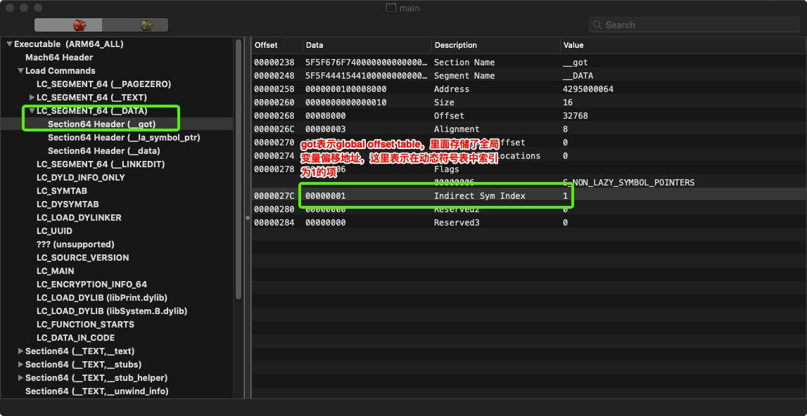
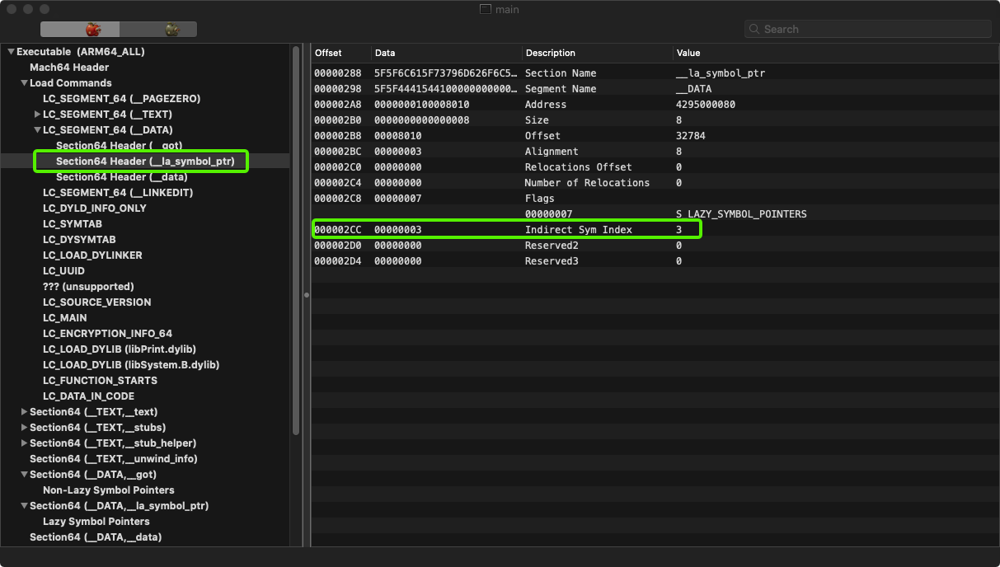
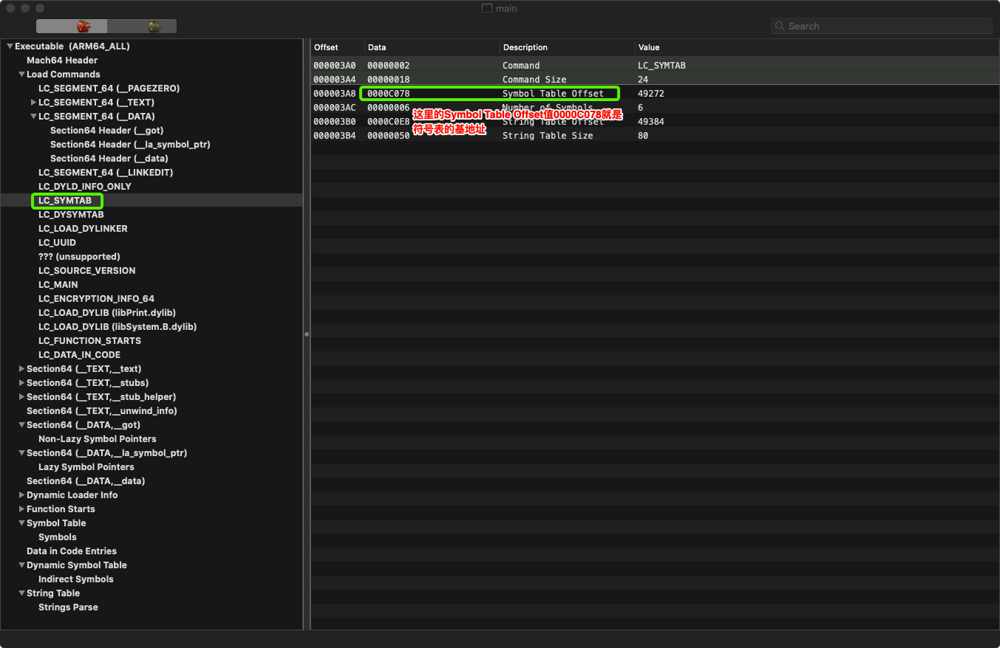
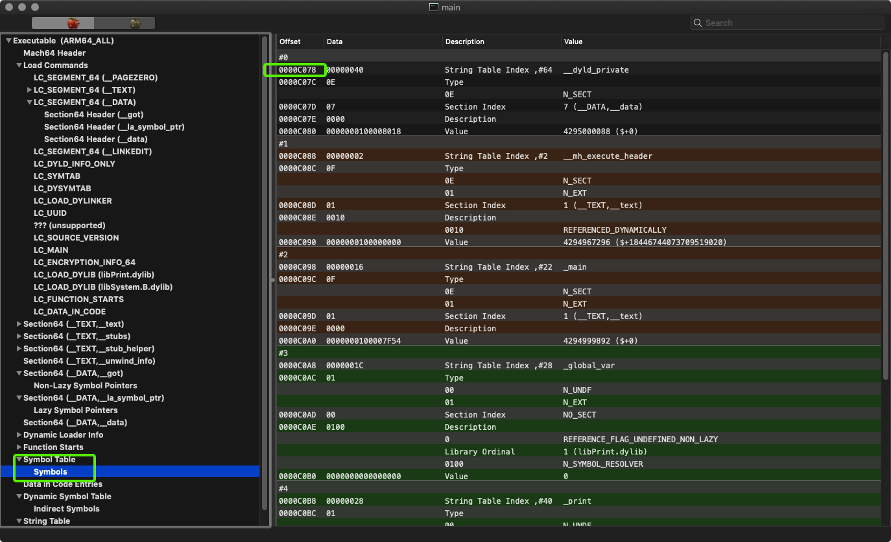
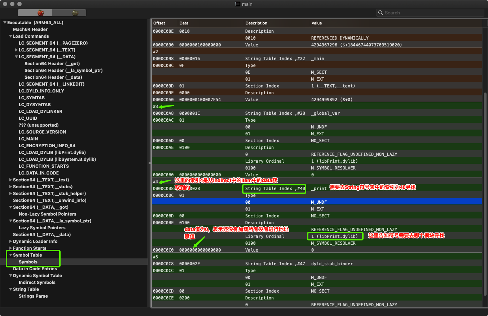

##OC动态链接实现原理

1. dysymtab_command(LC_DYSYMTAB) 在动态链接Command中找到间接Indirect符号表地址0000C0D8

   ```
   //定义在<mach-o/loader.h>中
   struct dysymtab_command {
       uint32_t cmd;	/* LC_DYSYMTAB */
       uint32_t cmdsize;	/* sizeof(struct dysymtab_command) */
       ... 这里省略了好多暂时不需关心的字段（这个命令太多字段）
       uint32_t indirectsymoff; /* file offset to the indirect symbol table 指向间接符号表位置*/
       uint32_t nindirectsyms;  /* number of indirect symbol table entries 间接符号表里元素的个数*/
       .... 省略
   };	
   ```

   

2. 根据地址定位到Indirect Symbol间接符号表，#序号 表示符号表索引（并不真实存在该数据结构，只是根据 (offset地址 - 动态符号表base地址0000C0D8) / 指针字节数4 计算得到），根据间接符号表中的data（如#3中的值为00000004，表示重定位地址需要去Symbol Table中的索引为4的item中，Description中也描述了Symbol Table Index,#4）值去Symbol Table查找具体的dylib信息。

3. 去LC_SEGMENT_64中的DATA中找到got section，下面的data(图中为00000001)表示Indirect间接寻址符号表的索引，结合2中的图片，即表示global_var变量
   

4. 去LC_SEGMENT_64中的DATA中找到_la_symbol_ptr section，下面的data(图中为00000003)表示Indirect间接寻址符号表的索引，结合2中的图片，即表示_print函数索引，
   

5. symtab_command(LC_SYMTAB) 在该Command中找到符号表地址0000C078
   

6. 根据Indirect表base地址+Indirect Symbol Table索引 得到  Symbol Table索引，然后根据5得到的Symbol Table Base地址 + 符号表索引得到，同时，在Symbol Table下可以得到动态链接的libPrint.dylib,没有运行的时候，该索引下面的item中的data为0，如果已经运行过，那么这里就是具体重定向的地址值。

   
   

   
